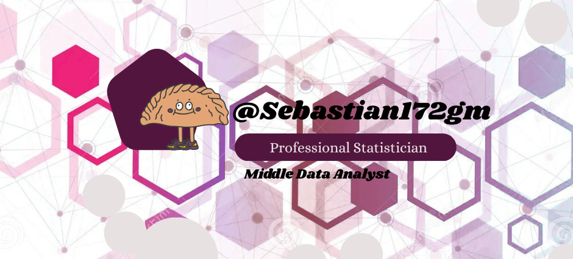

<h1 align="center">Hello World!! I'm Sebas 👋</h1>

# 💫 About Me:

🔍 Statistician  |  🖥️  Senior Data Analyst  | 💡 Data Science Enthusiast 

I am a Statistician with 4 years of experience in data analysis, visualization, and modeling. I graduated from Universidad ECCI, and throughout my career, I have worked across various sectors, gaining a deep understanding of their dynamics and challenges. My focus is always on strategic decision-making through accurate and efficient data analysis.

My ability to work effectively in collaborative and multidisciplinary environments has allowed me to excel in projects requiring both technical skills and strong interpersonal relationships. I am committed to excellence in customer service, always aiming to exceed expectations and provide solutions that deliver real value.

# 💻 Tech Stack:
                     
# ⚙️ &nbsp;GitHub Analytics:
 
 

---

<!-- Proudly created with GPRM ( https://gprm.itsvg.in ) -->
<picture>
  <source media="(prefers-color-scheme: dark)" srcset="https://raw.githubusercontent.com/tobiasmeyhoefer/tobiasmeyhoefer/output/github-snake-dark.svg" />
  <source media="(prefers-color-scheme: light)" srcset="https://raw.githubusercontent.com/tobiasmeyhoefer/tobiasmeyhoefer/output/github-snake.svg" />
  
</picture>

## Proyectos *overall*
<table>
<tr>
<td width="50%">
<h3 align="center">Curso Android Básico</h3>

 <strong>Challenge Repos</strong> - En este repositorio encontraras todos los Challenge que se desarrollaron dentro del diplomado de Ciencia de datos del programa <strong> Challenge One de Oracle </strong>.

                                                                                      
</td>

<td width="50%">
 
<h3 align="center">Statistical's Projects</h3>

                                       

 

 Durante mi  <strong>IMPRESCINDIBLES</strong> para poder trabajar como desarrollador/a Android. En este curso, divido por ramas irás aprendiendo a implementar una arquitectura real y robusta con inyección de dependencias, clean architecture, testing y mucho más.

                                                             
</table>                                                                                 

 

